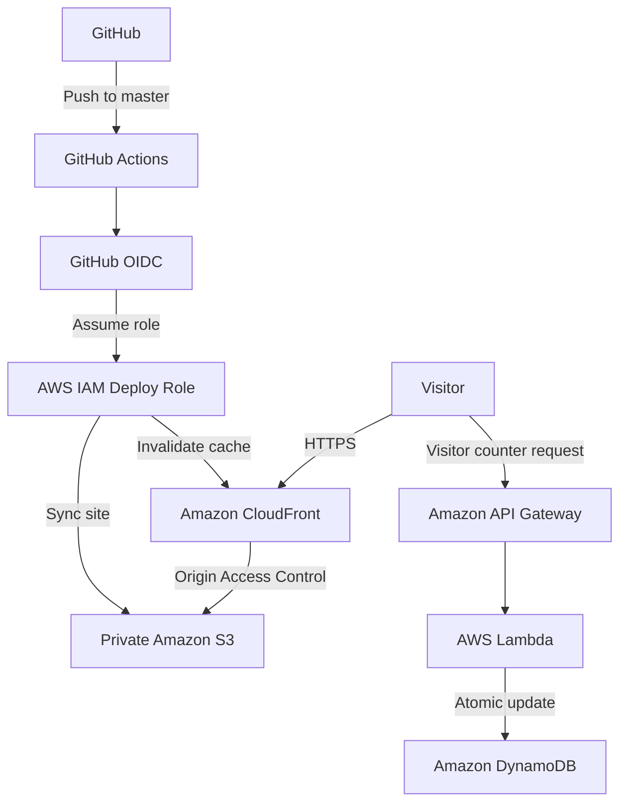

# Cloud Resume

A serverless resume and portfolio site built on AWS with Terraform, designed around zero intentional spend, least-privilege access, and keyless CI/CD.

This project is an implementation of the Cloud Resume Challenge.

## Architecture



The site uses:

- Amazon S3 for private static-site storage
- Amazon CloudFront for HTTPS delivery and caching
- Origin Access Control to keep the S3 bucket private
- Amazon API Gateway for the visitor-counter API
- AWS Lambda for serverless application logic
- Amazon DynamoDB for atomic visitor-count persistence
- Terraform for infrastructure as code
- GitHub Actions for continuous deployment
- GitHub OIDC for short-lived AWS authentication

## Design Goals

This implementation emphasizes:

- zero intentional AWS spend
- infrastructure as code
- least-privilege access
- no long-lived AWS access keys
- independently validated infrastructure changes
- small, reviewable deployment increments

## Architecture Decisions

### Private S3 Origin

The S3 bucket is not publicly accessible. CloudFront accesses site content through Origin Access Control.

### Atomic Visitor Counter

The Lambda function uses a DynamoDB atomic update rather than a read-modify-write sequence, avoiding lost updates under concurrency.

### Keyless CI/CD

GitHub Actions authenticates to AWS using OpenID Connect and assumes a narrowly scoped deployment role. No AWS access keys are stored in GitHub.

### Cost Control

The project was designed around a strict zero-spend goal. AWS services and Free Tier behavior were evaluated before provisioning resources, and a zero-spend AWS Budget was configured before application infrastructure was created.

## Repository Structure

```text
.
├── .github/workflows/   # CI/CD workflows
├── lambda/              # Visitor-counter Lambda
├── scripts/             # Local deployment tooling
├── site/                # Static resume site
└── terraform/           # AWS infrastructure
```

## Deployment

Changes under `site/` pushed to `master` trigger GitHub Actions.

The deployment workflow:

1. authenticates to AWS through GitHub OIDC
2. assumes a narrowly scoped IAM deployment role
3. synchronizes `site/` to the private S3 bucket
4. creates a CloudFront invalidation

Site deployment is intentionally separate from Terraform infrastructure deployment.

## Local Development

Serve the static site locally:

```bash
cd site
python3 -m http.server 8000
```

Then open:

```text
http://localhost:8000
```

The visitor counter calls the deployed API Gateway endpoint, so local testing can exercise the real Lambda and DynamoDB backend.

Terraform uses the `resume-challenge` AWS CLI profile with temporary credentials. If the session expires:

```bash
aws login --profile resume-challenge
```

To deploy the static site manually:

```bash
./scripts/deploy-site.sh
```

Normal site deployments are handled automatically by GitHub Actions.

## Infrastructure

AWS infrastructure is managed with Terraform under [`terraform/`](terraform/).

Terraform manages the supporting cloud resources, while static site content is deployed separately through GitHub Actions or the local deployment script.

The current infrastructure includes:

- a private Amazon S3 bucket for static site content
- an Amazon CloudFront distribution with Origin Access Control
- an Amazon DynamoDB table for visitor-count persistence
- an AWS Lambda function for the visitor counter
- an Amazon API Gateway HTTP API exposing the counter endpoint
- IAM roles and policies using least-privilege permissions
- a GitHub OpenID Connect provider and deployment role for keyless CI/CD

### Terraform Workflow

Initialize the working directory:

```bash
terraform -chdir=terraform init
```

Format and validate the configuration:

```bash
terraform -chdir=terraform fmt
terraform -chdir=terraform validate
```

Review proposed infrastructure changes:

```bash
terraform -chdir=terraform plan
```

Apply infrastructure changes only after reviewing the plan:

```bash
terraform -chdir=terraform apply
```

### Terraform State

Terraform state is kept locally and intentionally excluded from Git.

Provider binaries, generated Lambda archives, state files, and other Terraform working files are also excluded from the repository.

## What I Learned

This project reinforced that the interesting part of cloud engineering is often not creating resources, but understanding the boundaries around them.

A few lessons stood out:

- **Validate assumptions early.** I checked local tooling, AWS identity, account type, Free Tier behavior, and Terraform plans before provisioning resources. That caught issues before they became expensive or difficult to unwind.
- **Free Tier does not automatically mean zero cost.** Service pricing, account-plan behavior, logging, DNS, public IPs, and optional features all need to be evaluated independently.
- **Keep public access at the edge.** The S3 bucket remains private, with CloudFront Origin Access Control providing the read path for site content.
- **Prefer temporary credentials.** Local AWS access uses temporary login sessions, while GitHub Actions uses OIDC to assume a deployment role. No long-lived AWS access keys are required.
- **Least privilege is easier when responsibilities are narrow.** The Lambda role can update only the visitor-counter table, while the GitHub deployment role can only publish site content and invalidate CloudFront.
- **Atomic operations matter even in small projects.** The visitor counter uses a DynamoDB atomic update instead of a read-modify-write sequence, avoiding race conditions.
- **Separate infrastructure from application deployment.** Terraform manages AWS resources, while normal site updates are deployed independently through GitHub Actions.
- **Reviewing plans is part of the workflow.** Each infrastructure change was validated with `terraform fmt`, `terraform validate`, and `terraform plan` before applying it.

The Cloud Resume Challenge turned out to be less about building a resume page and more about connecting infrastructure, security, application code, deployment automation, and cost awareness into one coherent system.
